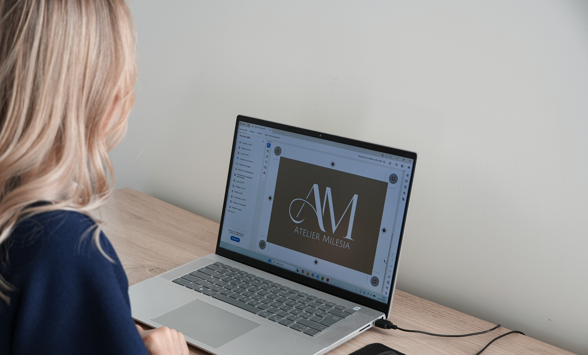

<!DOCTYPE html>
<html lang="fr">
<head>
<meta charset="UTF-8">
<meta name="viewport" content="width=device-width, initial-scale=1.0, maximum-scale=1.0, user-scalable=no">
<title>Atelier Milesia — Graphisme & Création Vidéo</title>
<link href="https://fonts.googleapis.com/css2?family=Cormorant+Garamond:ital,wght@0,300;0,400;0,600;1,300;1,400;1,600&family=Jost:wght@300;400;500&display=swap" rel="stylesheet">

</head>
<body>

<nav id="main-nav">
  

    
  

  

    <a class="nav-link" onclick="showPage('services')">Services</a>
    <a class="nav-link" onclick="showPage('portfolio')">Mes créations</a>
    <a class="nav-link" onclick="showPage('contact')">Contact</a>
    <a href="https://www.instagram.com/atelier.milesia/" target="_blank" class="nav-instagram">
      <svg width="20" height="20" viewBox="0 0 24 24" fill="none" stroke="currentColor" stroke-width="1.5">
        <rect x="2" y="2" width="20" height="20" rx="5" ry="5"/><path d="M16 11.37A4 4 0 1 1 12.63 8 4 4 0 0 1 16 11.37z"/><line x1="17.5" y1="6.5" x2="17.51" y2="6.5"/>
      </svg>
    </a>
  

</nav>

  

    

      <h1 class="hero-title">Atelier Milesia est un atelier de graphisme et de création vidéos</h1>
      <button class="hero-btn" onclick="showPage('services')">En savoir plus</button>
    

    <section style="background: var(--white); padding: 0; overflow: hidden;">
      

    </section>
    <section style="padding-top: 5rem; padding-bottom: 5rem;">
      

        

          
          <input type="file" id="about-img-input" accept="image/*" style="display:none;" onchange="loadAboutImg(this)">
        

        

          <h2>D’une idée, à un univers unique.</h2>
          
Graphiste freelance basée dans le sud de la France, j’ai fondé Atelier Milesia pour accompagner les marques et les entreprises dans la création d’identités visuelles fortes et cohérentes. Ici, chaque idée devient le point de départ d’un univers graphique singulier.

          
Chaque projet est avant tout une rencontre : une vision à comprendre, un univers à explorer, une histoire à révéler. J’allie exigence créative et sensibilité esthétique pour imaginer des visuels qui racontent votre histoire et refléter pleinement votre identity.

          
Aujourd’hui, mon travail s’articule autour de trois axes complémentaires : l’identité de marque, la création graphique et la production vidéo. Trois domaines qui me permettent d’offrir un accompagnement complet et cohérent, au service d’une communication claire et alignée avec vos valeurs.

          <button class="hero-btn" onclick="showPage('contact')">Travaillons ensemble</button>
        

      

    </section>
  

  <footer>
    
Atelier Milesia

    
© 2026 Atelier Milesia — Graphisme & Creation Vidéo

    

      <button class="footer-link-btn" onclick="showPage('mentions')">Mentions légales</button>
    

  </footer>

  

    <section style="padding-top: 0; padding-bottom: 5rem;">
      

        
        

          
Services

        

        

          
De l'identité visuelle au contenu vidéo, chaque projet est pensé avec soin pour refléter votre univers.

        

      

      

        <h3 class="target-title">À qui s'adressent mes services ?</h3>
        

          
Entreprise et marque

          
Évènementiel

          
Particulier

        

      

      

        

          <h4 class="service-title-serif">Identité visuelle</h4>
          
Création complète de votre univers graphique : logo, typographies, palette de couleurs et déclinaisons visuelles.

        

        

          <h4 class="service-title-serif">Création graphique</h4>
          
Flyers, dépliants, cartes de visite, brochures, affiches, menus, etc.

        

        

          <h4 class="service-title-serif">Création de site vitrine</h4>
          
Conception d’un site web sur mesure, ergonomique et esthétique, pensé pour refléter votre identity.

        

        

          <h4 class="service-title-serif">Réseaux sociaux</h4>
          
Création de contenus visuels et de vidéos courtes pour vos plateformes.

        

        

          <h4 class="service-title-serif">Création vidéo</h4>
          
Production et montage de vidéos sur mesure pour le web et les réseaux sociaux.

        

      

      
<button class="hero-btn" onclick="showPage('contact')">Démarrer un projet</button>

    </section>
  

  <footer>
    
Atelier Milesia

    
© 2026 Atelier Milesia — Graphisme & Création Vidéo

    

      <button class="footer-link-btn" onclick="showPage('mentions')">Mentions légales</button>
    

  </footer>

  

    <button class="modal-close" onclick="closeModal(event, true)">&times;</button>
    <h2 class="modal-title">Entreprise et marque</h2>
    
    
Identité visuelle

    <ul class="modal-list">
      <li>Création d’une identity graphique complète</li>
      <li>Définition d’une charte graphique</li>
      <li>Déclinaisons visuelles pour tous les supports de communication</li>
    </ul>

    

    
Création de logo

    

    
Conception de supports professionnels

    <ul class="modal-list">
      <li>Cartes de visite, dépliants, flyers, affiches</li>
      <li>Cartes cadeaux, brochures, menus, etc.</li>
    </ul>

    

    
Packagings - étiquettes

    <ul class="modal-list">
      <li>Boîtes d’emballages</li>
    </ul>

    

    
Site vitrine

    

    
Création de vidéos courtes

    <ul class="modal-list">
      <li>Création de vidéos pour les réseaux sociaux</li>
      <li>Création de vidéos pour le web</li>
      <li>Campagnes publicitaires</li>
    </ul>
  

  

    <button class="modal-close" onclick="closeModal(event, true)">&times;</button>
    <h2 class="modal-title">Évènementiel</h2>
    

      Événement professionnel ou particulier
      
(mariage, baptême, anniversaire, séminaire, etc…) :

    

    <ul class="modal-list">
      <li>Faire part</li>
      <li>Carton d’invitation</li>
      <li>Logo</li>
      <li>Affiche, flyer, etc…</li>
    </ul>
  

  

    <button class="modal-close" onclick="closeModal(event, true)">&times;</button>
    <h2 class="modal-title">Particulier</h2>
    
Création et impression personnalisée sur papier ou objet.

  

  

    <section style="padding-top: 4rem; padding-bottom: 5rem;">
      

        <h2 class="mentions-title-line">Mentions légales</h2>
        

          <h3>1. Éditeur du site</h3>
          
Le site internet Atelier Milesia éditée et géré par l'Atelier Milesia.

          
Statut : Entreprise Individuelle (Freelance) Activité : Graphisme, création visuelle et production vidéo. Lieu d'activité : Sud de la France, Lot. Contact : Via le formulaire de contact du site ou à l'adresse e-mail suivante : <a href="mailto:contact@atelier-milesia.fr" class="email-link">contact@atelier-milesia.fr</a>

        

        

          <h3>2. Hébergement</h3>
          
Ce site est hébergé par Vercel.

        

        

          <h3>3. Propriété intellectuelle</h3>
          
L’ensemble des contenus de ce site (textes, photographies, logos, créations graphiques, vidéos, maquettes) constitutes une œuvre protégée par les lois en vigueur sur la propriété intellectuelle. Toute reproduction, representation, modification ou adaptation totale ou partielle des éléments du site sans accord écrit préalable est strictement interdite.

        

        

          <h3>4. Données personnelles</h3>
          
Les informations recueillies via le formulaire de contact (Nom, Prénom, E-mail, détails du projet) sont uniquement destinées au traitement de votre demande de projet par l'Atelier Milesia. Elles ne sont en aucun cas cédées ou vendues à des tiers.

        

        

          <button class="target-btn" onclick="showPage('home')">Retour à l'accueil</button>
        

      

    </section>
  

  <footer>
    
Atelier Milesia

    
© 2026 Atelier Milesia — Graphisme & Création Vidéo

    

      <button class="footer-link-btn" onclick="showPage('mentions')">Mentions légales</button>
    

  </footer>

  

    <section>
      
Mes créations

      

    </section>
  

  <footer>
    
Atelier Milesia

    
© 2026 Atelier Milesia — Graphisme & Création Vidéo

    

      <button class="footer-link-btn" onclick="showPage('mentions')">Mentions légales</button>
    

  </footer>

  

    

      

        <h1 class="contact-title">Contact</h1>
        
Que vous ayez une question, une idée de projet ou le souhait de réaliser un projet déjà établi, n'hésitez pas à me contacter.

        

          
<label class="form-label">Nom et Prénom (obligatoire)</label><input type="text" class="form-input" id="f-name" name="Nom_Prenom">

          
<label class="form-label">Nom de l'entreprise</label><input type="text" class="form-input" id="f-company" name="Nom_Entreprise">

          
<label class="form-label">E-mail (obligatoire)</label><input type="email" class="form-input" id="f-email" name="Email">

          
<label class="form-label">Téléphone</label><input type="tel" class="form-input" id="f-phone" name="Telephone">

          

            <label class="form-label">Type de projet</label>
            

              <label class="radio-label"><input type="radio" name="project_type" value="identite_visuelle"> Identité visuelle</label>
              <label class="radio-label"><input type="radio" name="project_type" value="logo"> Logo</label>
              <label class="radio-label"><input type="radio" name="project_type" value="video"> Création vidéo(s)</label>
              <label class="radio-label"><input type="radio" name="project_type" value="object"> Création graphique sur objet</label>
              <label class="radio-label"><input type="radio" name="project_type" value="autre"> Autre</label>
            

          

          
<label class="form-label">Date de début du projet</label><input type="date" class="form-input" id="f-date" name="Date_Debut" style="max-width: 250px;">

          
<label class="form-label">Détails du projet (obligatoire)</label><textarea class="form-textarea" id="f-details" name="Details_Projet" rows="5"></textarea>

          <button class="submit-btn" id="f-submit-btn" onclick="submitForm()">Envoyer</button>
        

      

    

  

  <footer>
    
Atelier Milesia

    
© 2026 Atelier Milesia — Graphisme & Création Vidéo

    

      <button class="footer-link-btn" onclick="showPage('mentions')">Mentions légales</button>
    

  </footer>

  

    

      

        

          <h1 class="contact-title">Merci !</h1>
          

            <label class="form-label">Dernière petite question : Par quel moyen avez-vous entendu parler d'Atelier Milesia ?</label>
            

              <label class="radio-label"><input type="radio" name="discovery_source" value="bouche-oreille"> Le bouche-à-oreille</label>
              <label class="radio-label"><input type="radio" name="discovery_source" value="moteurs-recherche"> Les moteurs de recherches</label>
              <label class="radio-label"><input type="radio" name="discovery_source" value="reseaux-sociaux"> Les réseaux sociaux</label>
              <label class="radio-label"><input type="radio" name="discovery_source" value="cartes-visites"> Les cartes de visites</label>
            

          

          <button class="submit-btn" id="f-discovery-btn" onclick="submitDiscoveryForm()">Terminer</button>
        

        
        

          Merci pour ces informations. Votre demande de projet a bien été prise en compte et sera traitée dans les plus brefs délais. À très bientôt.
        

      

    

  

  <footer>
    
Atelier Milesia

    
© 2026 Atelier Milesia — Graphisme & Création Vidéo

    

      <button class="footer-link-btn" onclick="showPage('mentions')">Mentions légales</button>
    

  </footer>

</body>
</html>
